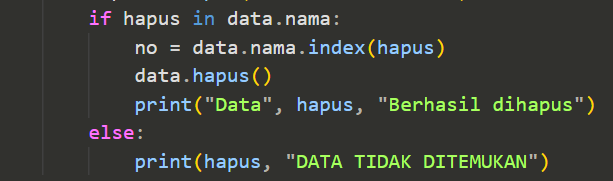
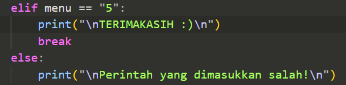

# Nama : Muhammad Iqbal Fadillah

# Kelas : TI.22 B.2

# NIM : 312210586

# Mata Kuliah = Bahasa Pemrograman

# 
PRAKTIKUM 8

# 
Penjelasan Program

# <b>CODE</b>
Program yang mengaplikasikan penggunaan Class

# <b>PENJELASAN</b>
# 1. Membuat Class
Langkah pertama adalah membuat/mendeklarasikan sebuah class Mahasiswa(): yang didalamnya terdapat atribut NIM, Nama, nilai tugas, nilai UTS dan nilai UAS. Untuk mendeklarasikan sebuah class didalam OOP kita harus gunakan def__init__ dan juga self.

# 2. Membuat Menu Table
Untuk membuat table sebuah menu kita dapat menggunakan fungsi menutabel(): yang didalamnya terdapat program sebuah menu yang dapat di input.

# 3. Menambahkan Data
Disini kita perlu menambahkan method seperti menambahkan, menampilkan, menghapus, dan mengubah data mahasiswa. Pada sebuah method tambah() ini berfungsi untuk menambahkan data. Dalam method ini kita menggunakan append() agar data yang terakhir ditambahkan ada di urutan list paling akhir.

# 4. Membuat Method Tambah
Disini kita perlu menambahkan method seperti menambahkan, menampilkan, menghapus, dan mengubah data mahasiswa. Pada sebuah method tambah() ini berfungsi untuk menambahkan data. Dalam method ini kita menggunakan append() supaya data yang terakhir ditambahkan, ada di urutan list paling akhir.

# 5. Membuat Method Lihat 
Method lihat() Berguna untuk menampilkan seluruh data yang telah ditambahkan. Bilamana data tersebut belum diinput/data tersebut sudah terhapus, Maka akan keluar ouput dengan tulisan "TIDAK ADA DATA". Kita menggunakan for loop untuk menampilkan banyaknya data. 
Nantinya data akan ditampilkan sebanyak n kali.

# 6. Membuat Method Ubah
Method ubah() ini berfungsi sebagai menu mengubah data yang telah diinput, Inputan tersebut didalamnya terdapat atribut nama, Sedangkan untuk penginputan sebuah nim, tugas, uts, dan uas dapat kita ubah sesuai kebutuhan.

# 7. Membuat Method Hapus
Source Code dibawah adalah untuk penghapusan sebuah data pada program yang sebelumnya telah diinput. Dan inputan dari kodingan ini berdasarkan "nama" yang sebelumnya telah di input.

# 8. Membuat Dictionary
Mendeklarasikan satu dictionary kosong sebagai tempat menyimpan data-data yang sudah kita input. Disini ada 5 list kosong yang nanti isinya terdapat NIM, Nama, nilai tugas, nilai UTS dan nilai UAS.

# 9. Menjalankan Program
Source Code dibawah adalah untuk penghapusan sebuah data pada program yang sebelumnya telah diinput. Dan inputan dari kodingan ini berdasarkan "nama" yang sebelumnya telah di input.

# 8. Menghentikan Program
Jika data sudah selesai diinput, Pilih menu ke (Keluar) yaitu "5", Maka program secara otomatis akan berhenti.

# <b>OUTPUT</b>
* Menambahkan Data dengan input 1 dan menampilkan data dengan input 2.

* Mengubah Data dengan input 3 dan menampilkan data dengan input 2

* Menghapus Data dengan input 4 dan keluar dari program input 5

